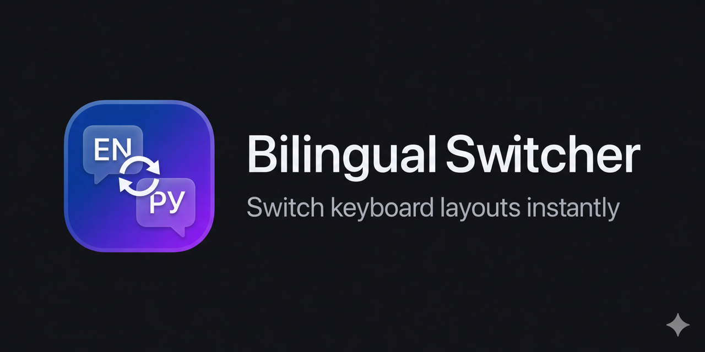

<p align="center">
  
</p>

<p align="center">
  <a href="https://github.com/komandakycto/bilingual-switcher/actions/workflows/ci.yml"></a>
  <a href="https://github.com/komandakycto/bilingual-switcher/releases/latest"></a>
  
  <a href="LICENSE"></a>
</p>

<p align="center">
A lightweight macOS menu bar app that converts selected text between<br>
any two keyboard layouts with a single hotkey.
</p>

---

Ever type a whole sentence only to realize your keyboard was in the wrong language?

`Ghbdtn vbh!` instead of `Привет мир!` — or `Руддщ Цщкдв!` instead of `Hello World!`

Select the text, press **⌥⌘S**, and it's instantly fixed. Works with any language pair — not just English and Russian.

## Features

- **Instant conversion** — select text, press hotkey, done
- **Any language pair** — dynamically reads your installed keyboard layouts via macOS APIs, no hardcoded mappings
- **Auto-detection** — detects which layout produced the text and converts to the other
- **Works everywhere** — GUI apps, terminals (iTerm, Terminal.app, Claude Code), text editors
- **Configurable hotkey** — set any key combination in Preferences (default: ⌥⌘S)
- **Auto-switch keyboard layout** — optionally switch to the target language after conversion
- **Launch at Login** — start automatically with macOS
- **Auto-updates** — built-in update checking via Sparkle
- **Privacy-first** — no telemetry, no data collection; only network access is optional update checks
- **Lightweight** — native Swift, no Electron, minimal resource usage

## Supported Languages

The app works with **any keyboard layout installed on your Mac** that uses physical key mapping — this covers most languages:

**Tested:** English, Russian, Ukrainian, French, German, Spanish, Portuguese, Italian

**Should work (same mechanism):** Polish, Czech, Turkish, Swedish, Norwegian, Danish, Dutch, Romanian, Hungarian, and any other standard keyboard layout

**Not supported:** CJK input methods (Chinese, Japanese, Korean) — these use composing engines, not direct key mapping

## Install

### Homebrew (recommended)

```bash
brew tap komandakycto/bilingual-switcher https://github.com/komandakycto/bilingual-switcher.git
brew install --cask bilingual-switcher
```

Homebrew automatically strips the macOS quarantine flag — the app opens without Gatekeeper prompts.

### Manual download

Download the latest `.dmg` from [Releases](https://github.com/komandakycto/bilingual-switcher/releases), open it, and drag the app to Applications.

**Gatekeeper notice:** The app is ad-hoc signed (not notarized with Apple). Before first launch:

```bash
xattr -cr /Applications/BilingualSwitcher.app
```

Or: try to open the app, get blocked, then go to **System Settings → Privacy & Security** → scroll down → **Open Anyway**.

You can verify the download integrity with SHA256 checksums from the [release page](https://github.com/komandakycto/bilingual-switcher/releases).

### Build from source

Requires Xcode Command Line Tools (`xcode-select --install`).

```bash
git clone https://github.com/komandakycto/bilingual-switcher.git
cd bilingual-switcher
make setup     # downloads Sparkle framework
make
make install   # copies to /Applications
```

## Usage

1. **Launch** the app — it appears as an icon in the menu bar
2. **Grant Accessibility permission** when prompted (required to read/replace selected text)
3. **Select** the wrongly-typed text in any app
4. **Press the hotkey** (default: `⌥⌘S` — Option + Command + S)
5. The text is converted in place

### Changing the hotkey

Menu bar icon → Preferences → click the shortcut field → press your desired combination → Save.

### Examples

| You typed | You get |
|-----------|---------|
| `Ghbdtn vbh!` | `Привет мир!` |
| `Руддщ Цщкдв!` | `Hello World!` |
| `Dctv ghbdtn` | `Всем привет` |
| `Рфззн Ишкесфн` | `Happy Birthday` |

## How it works

The app uses the macOS `UCKeyTranslate` API to read the character map of every keyboard layout installed on your system. When triggered:

1. Copies the selected text (simulates ⌘C)
2. Scores the text against each installed layout to detect which one produced it
3. Converts each character via physical key codes: source layout char → key code → target layout char
4. Deletes the original and pastes the result
5. Restores your original clipboard

With 3+ layouts installed, the app tracks the two you most recently switched between and converts within that pair.

## Requirements

- macOS 13.0 (Ventura) or later
- Accessibility permission (prompted on first launch)

## Contributing

See [CONTRIBUTING.md](CONTRIBUTING.md) for build instructions and guidelines.

## License

[MIT](LICENSE)
