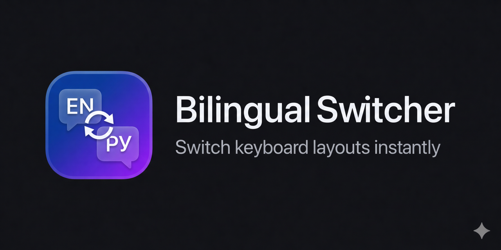
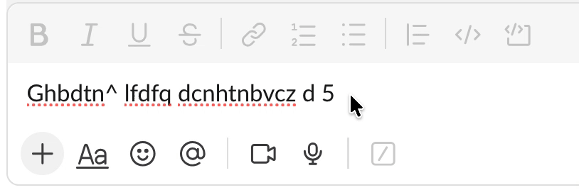

<p align="center">
  
</p>

<p align="center">
  <a href="https://github.com/komandakycto/bilingual-switcher/actions/workflows/ci.yml"></a>
  <a href="https://github.com/komandakycto/bilingual-switcher/releases/latest"></a>
  
  <a href="LICENSE"></a>
</p>

<p align="center">
Fix text typed in the wrong keyboard layout — for <em>any</em> two layouts<br>
installed on your Mac, not just English and Russian.
</p>

---

Ever type a whole sentence only to realize your keyboard was in the wrong language?

`Ghbdtn vbh!` instead of `Привет мир!` — or `Руддщ Цщкдв!` instead of `Hello World!`

Select the text, press **⌥⌘S**, and it's fixed in place.

The app reads the character map of every layout macOS has installed, so it works
for pairs that hardcoded English↔Russian tools can't reach: Greek, Hebrew,
Armenian, Georgian — and same-script pairs like QWERTY↔AZERTY or QWERTY↔QWERTZ.

> **Русский:** Bilingual Switcher исправляет текст, набранный не в той раскладке: выделил, нажал хоткей — готово (`ghbdtn` → `привет`). Работает с любой парой раскладок, установленных в системе, а не только с русской и английской. Установка через Homebrew или DMG — см. раздел [Install](#install).

<p align="center">
  
</p>

## Features

- **Any pair of layouts** — reads your installed layouts through the macOS `UCKeyTranslate` API at runtime. No hardcoded mappings, no built-in language list
- **Never watches you type** — no event tap, no keystroke buffer. macOS wakes the app on your hotkey and at no other moment
- **Deterministic** — converts exactly what you selected, key by key, from the system's own layout tables. No word lists, no language model, no guessing
- **Nothing happens on its own** — it fires when you press the hotkey. Your text is never rewritten while you type
- **Works everywhere** — GUI apps, terminals (iTerm, Terminal.app, Claude Code), text editors
- **Configurable hotkey** — any key combination, or a modifier-only tap like ⌥⌘ (default: ⌥⌘S)
- **Auto-switch keyboard layout** — optionally switch to the target language after conversion
- **Launch at Login** — start automatically with macOS
- **Auto-updates** — built-in update checking via Sparkle
- **Small enough to read** — ~2,300 lines of Swift, under 5 MB installed, no Electron

## What it doesn't do

These are design choices, and they are the reason the app is worth trusting with
an Accessibility grant:

- **No keylogger.** The app installs no `CGEventTap`. In the default mode it registers your shortcut with the system, which then delivers that one combination and nothing else. If you bind a *modifier-only* combo, the app adds a single passive monitor that can see key events — it reads only *that* a key was pressed, to cancel the gesture, never which key ([`ModifierOnlyHotkeyMonitor.swift`](Sources/ModifierOnlyHotkeyMonitor.swift)).
- **No Input Monitoring permission.** That grant exists to gate event taps. The app doesn't use one, so macOS never asks.
- **No dictionaries, no autocorrect.** Nothing is guessed from your vocabulary, so code, transliteration, brand names and mixed technical text convert as reliably as prose.
- **No telemetry.** No analytics, no crash reporting, no accounts. The only network access is the optional Sparkle update check.

Your clipboard *is* used: the app copies the selection with ⌘C, then puts the
clipboard back exactly as it was — every item, every data type, in the original
order. See [How it works](#how-it-works).

Verifying the above is meant to be practical rather than aspirational: the whole
source is ~2,300 lines of Swift, and every commit runs 128 tests in CI — plus the
same suite again under AddressSanitizer, and a static analysis pass.

## Supported Languages

The app works with **any keyboard layout installed on your Mac** that maps
physical keys to characters — which covers most languages, and both directions
of any pair.

**Tested:** English, Russian, Ukrainian, French, German, Spanish, Portuguese, Italian

**Same-script pairs work too:** QWERTY↔AZERTY, QWERTY↔QWERTZ, Dvorak, Colemak — the
app compares layouts, not alphabets

**Should work (same mechanism):** Greek, Hebrew, Armenian, Georgian, Polish, Czech,
Turkish, Swedish, Norwegian, Danish, Dutch, Romanian, Hungarian, and any other
standard keyboard layout

**Not supported:** CJK input methods (Chinese, Japanese, Korean) — these use
composing engines, not direct key mapping

## Install

### Homebrew (recommended)

```bash
brew tap komandakycto/bilingual-switcher https://github.com/komandakycto/bilingual-switcher.git
brew install --cask bilingual-switcher
```

Homebrew strips the macOS quarantine flag for you, so the app opens without
Gatekeeper prompts — and `brew upgrade` keeps it current.

### Manual download

Download the latest `.dmg` from [Releases](https://github.com/komandakycto/bilingual-switcher/releases), open it, and drag the app to Applications.

**Gatekeeper notice:** releases are signed with a stable identity but are *not*
notarized with Apple, so Gatekeeper blocks the first launch. Before opening:

```bash
xattr -cr /Applications/BilingualSwitcher.app
```

Or: try to open the app, get blocked, then go to **System Settings → Privacy & Security** → scroll down → **Open Anyway**.

You can verify the download integrity with SHA256 checksums from the [release page](https://github.com/komandakycto/bilingual-switcher/releases).

### Build from source

Requires Xcode Command Line Tools (`xcode-select --install`).

```bash
git clone https://github.com/komandakycto/bilingual-switcher.git
cd bilingual-switcher
make setup     # downloads Sparkle framework
make
make install   # copies to /Applications
```

## Usage

1. **Launch** the app — it appears as an icon in the menu bar
2. **Grant Accessibility permission** when asked — System Settings → Privacy & Security → Accessibility (required to read/replace selected text). The app picks it up as soon as you turn it on; no restart needed.
3. **Select** the wrongly-typed text in any app
4. **Press the hotkey** (default: `⌥⌘S` — Option + Command + S)
5. The text is converted in place

> **Selecting text inside terminal TUIs (Claude Code, vim, htop, lazygit):** full-screen terminal apps capture the mouse, so a plain click-drag is sent to the app instead of creating a selection — leaving nothing for the hotkey to copy. Hold **Shift** while dragging in **kitty**, or **Option** in **iTerm2**, to force a real terminal selection (other terminals have a similar modifier to bypass mouse reporting), then press the hotkey. If you press the hotkey with nothing selected, the app beeps.

### Changing the hotkey

Menu bar icon → Preferences → click the shortcut field → press your desired combination → Save.

You can also bind a **modifier-only** combo like ⌥⌘ — press and release the modifiers together with no other key. Two or more modifiers are required, and it fires only on a clean release, so ⌥⌘C and other real shortcuts still work as usual.

### Examples

| You typed | You get |
|-----------|---------|
| `Ghbdtn vbh!` | `Привет мир!` |
| `Руддщ Цщкдв!` | `Hello World!` |
| `Dctv ghbdtn` | `Всем привет` |
| `Рфззн Ишкесфн` | `Happy Birthday` |

## How it works

The app uses the macOS `UCKeyTranslate` API to read the character map of every keyboard layout installed on your system. When triggered:

1. Copies the selected text (simulates ⌘C)
2. Scores the text against each installed layout to detect which one produced it
3. Converts each character via physical key codes: source layout char → key code → target layout char
4. Deletes the original and pastes the result
5. Restores your original clipboard — every item and data type, in the order it had

With 3+ layouts installed, the app tracks the two you most recently switched between and converts within that pair.

## Requirements

- macOS 13.0 (Ventura) or later
- Accessibility permission (the app asks on first launch)

### Upgrading from 1.2.0 or earlier

Those builds were ad-hoc signed, so macOS tied your Accessibility grant to that
exact binary. Updating past them invalidates it: the app still shows in System
Settings → Privacy & Security → Accessibility with the toggle on, but macOS no
longer honours it. Toggling it off and on does not help.

Remove **Bilingual Switcher** from that list with **−**, then add it back with
**+**. The app offers to do this for you when it detects the situation. This is
a one-time step — releases are now signed with a stable identity, so the
permission survives future updates.

## Contributing

See [CONTRIBUTING.md](CONTRIBUTING.md) for build instructions and guidelines.

## License

[MIT](LICENSE)
